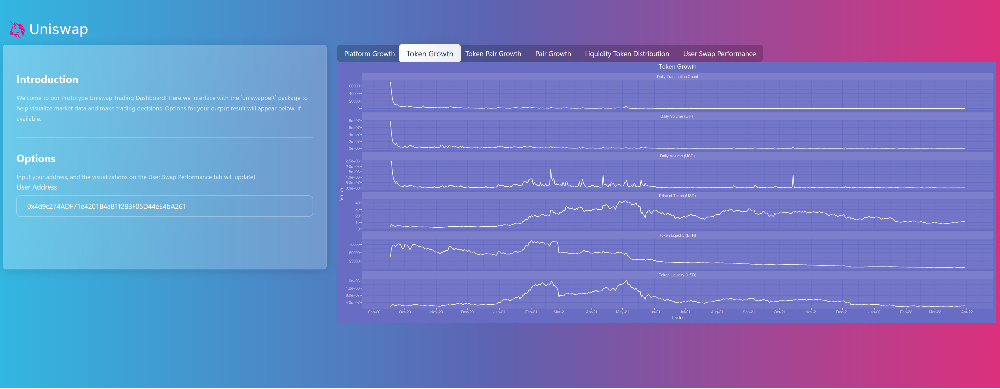

# A UniswappeR inspired Uniswap Platform Dashboard

## Description

The UniswappeR package hosts a score of visualizations useful for understanding macro platform growth and micro trading performance. This open source dashboard is an example of  UniswappeR's data collection and graphical capabilities. Please feel free to play with the [app here](https://crypto.omnianalytics.io/apps/uni-phase2-dashboard/).

## About Us

Omni Analytics Group is an incorporated group of passionate technologists who help others use data science to change the world. Our practice of data science leads us into many exciting areas where we enthusiastically apply our machine learning, artificial intelligence and analysis skills. Our flavor for 2021, the blockchain! To learn more about what we do or just to have fun, join us over on [Twitter](https://twitter.com/OmniAnalytics).
